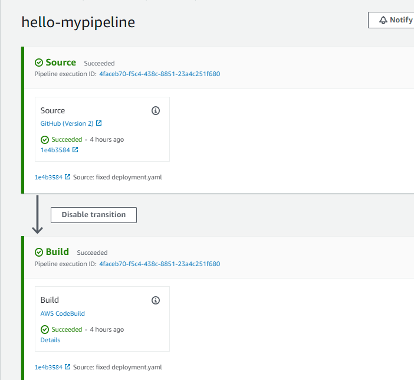
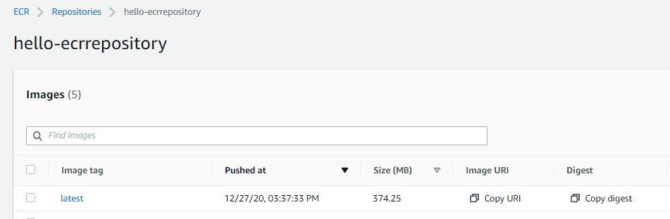
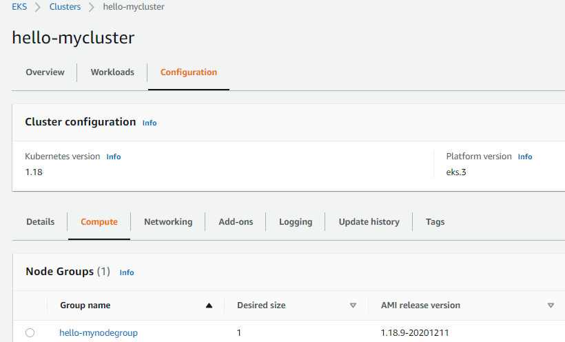
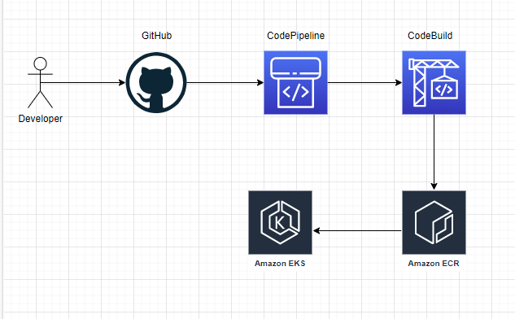

# Simple NodeJS Web Application CI/CD Pipeline

- The project builds a Kubernetes cluster on a AWS using EKS to run a simple 'Hello World' web application written in NodeJS.

 > Tools

- **Github** : Source Code Management
- **CodeBuild** : This is the CI server which handle the compiling and building the containers and push it to ECR
- **CodePipeline** : This is service required for automated as a pipeline 
- **EKS** : Kubernetes service provided by AWS. Cluster management is much easier with this service. 
- **ECR** : This is the private registry to manage the pool of our container images 
- **Terraform** : Fast and easy service install-uninstall by IAC 
- **IAM** : You use this service to control who is authenticated (signed in) and authorized (has permissions) to use resources.           

> App

- Simple web application written in NodeJS. You need to install npm modules for it work. But If you use Docker, It's not necessary. Because npm modules already comes from image.
### hello-world.js:
```python
var http = require('http');

var server = http.createServer(function(req, res) {
res.writeHead(200);
res.write('Hello World From NodeJS Abdullah');
res.end();
});
server.listen(8080)
```
### Dockerfile:

```Dockerfile
FROM node:12

WORKDIR /usr/src/app

COPY package*.json ./

RUN npm install

COPY . .

EXPOSE 8080

CMD [ "node", "hello-world.js" ]
```

> Source Control

- Using Github and Git. I used cause of public resource. You can check my repository to here. https://github.com/abdullahalaslan/aws-eks-pipeline

> Infrastructure

- Set up Pipeline services with terraform scripts (tf folder).These scripts just written for CodeBuild,CodePipeline.
 
 **tf folder** : set up CodeBuild, CodePipeline services and define environment variables. Also set IAM roles to services. 

> CI/CD

- Building and deploying code to EKS Cluster with CodeBuild. We used buildspec.yml for managing to the process.

### buildspec.yml:

```yaml
---
    version: 0.2
    phases:
      install:
        runtime-versions:
          nodejs: 12
        commands:
          - curl -o aws-iam-authenticator https://amazon-eks.s3.us-west-2.amazonaws.com/1.18.9/2020-11-02/bin/linux/amd64/aws-iam-authenticator
          - curl -sS -o kubectl https://amazon-eks.s3-us-west-2.amazonaws.com/1.14.6/2019-08-22/bin/linux/amd64/kubectl
          - chmod +x ./kubectl ./aws-iam-authenticator
          - export PATH=$PWD/:$PATH
      pre_build:
          commands:
            - $(aws ecr get-login --no-include-email)
            - export KUBECONFIG=$HOME/.kube/config
      build:
        commands:
          - docker build -t $REPOSITORY_URI .
          - docker tag $REPOSITORY_URI:latest $REPOSITORY_NAME:latest
    
      post_build:
        commands:
          - docker push $REPOSITORY_URI:latest
          - CREDENTIALS=$(aws sts assume-role --role-arn $EKS_KUBECTL_ROLE_ARN --role-session-name Case-User --duration-seconds 900)
          - export AWS_ACCESS_KEY_ID="$(echo ${CREDENTIALS} | jq -r '.Credentials.AccessKeyId')"
          - export AWS_SECRET_ACCESS_KEY="$(echo ${CREDENTIALS} | jq -r '.Credentials.SecretAccessKey')"
          - export AWS_SESSION_TOKEN="$(echo ${CREDENTIALS} | jq -r '.Credentials.SessionToken')"
          - export AWS_EXPIRATION=$(echo ${CREDENTIALS} | jq -r '.Credentials.Expiration')
          - aws eks update-kubeconfig --name $EKS_CLUSTER_NAME
          - kubectl apply -f service.yaml
          - kubectl apply -f deployment.yaml
```
- *Note*: Amazon EKS uses IAM to provide authentication to your Kubernetes cluster through the AWS IAM authenticator for Kubernetes. You can configure the stock kubectl client to work with Amazon EKS by installing the AWS IAM authenticator for Kubernetes and modifying your kubectl configuration file to use it for authentication.
- In Pre-Build step, login to ECR service.
- In Build step, create a image and set tags.
- In Post-Build step, the image created is push to ECR service.
We create kubectl role and assign action eks:describe permission to policy.
```json
{
    "Version": "2012-10-17",
    "Statement": [
        {
            "Effect": "Allow",
            "Action": "eks:Describe*",
            "Resource": "*"
        }
    ]
}
```
- We assume  the session user to the kubectl role. Cause of it is must have for working with kubectl command.
- Updated kubeconfig in Cluster.
- Create LoadBalancer type service and expose on port 8080
```yaml
---
apiVersion: v1
kind: Service
metadata:
  name: nodejs-app
spec:
  type: LoadBalancer
  ports:
    - port: 80
      targetPort: 8080
  selector:
    app: nodejs-app
```
- Create and deploy application. Run application with my latest ECR image.
```yaml
---
apiVersion: apps/v1
kind: Deployment
metadata:
  labels:
    app: nodejs-app
  name: nodejs-app
  namespace: default
spec:
  replicas: 1
  selector:
    matchLabels:
      app: nodejs-app
  template:
    metadata:
      labels:
        app: nodejs-app
    spec:
      containers:
        - name: status
          image: 574868243623.dkr.ecr.eu-central-1.amazonaws.com/hello-ecrrepository:latest
          ports:
            - containerPort: 8080
```

> Orchestration

- Push Docker image from Codebuild to ECR

- Deploy last image in ECR to EKS Cluster using CodeBuild and buildspec.yml
- Application running on one node. Desired size: 1
- You can access to this link http://a8a3886044fb347d381a0ab84237ee09-983269716.eu-central-1.elb.amazonaws.com/


## Pipeline Schema



## My Decisions and Reasons

### Why NodeJS Application?

- It's easy to write and you can handle dependencies with a single command. It's open source, So very easy to find helpful source in web.
### Why CodeBuild?

- Because If I will working on AWS, I prefer aws build service. CodeBuild is very easy making integration to pipeline. And You managing build and deploy process in one single yaml file. Simplicity is the key.

### Why EKS?

- If you want the flexibility to integrate externally with the open-source Kubernetes community, spending the additional effort on setting up EKS may be the better option. Also my experience always be on EKS. 